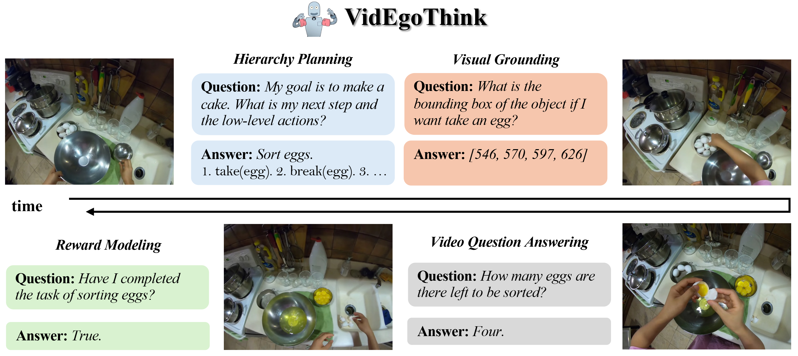
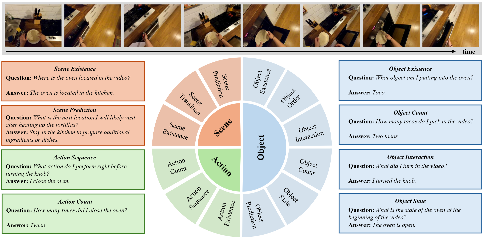
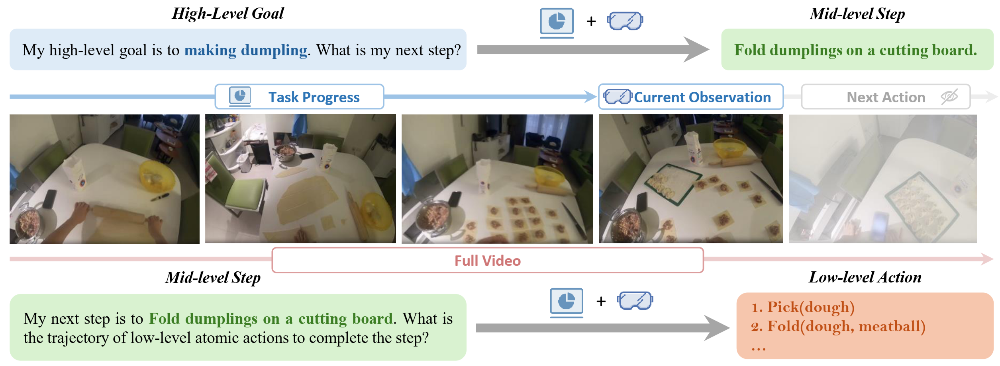
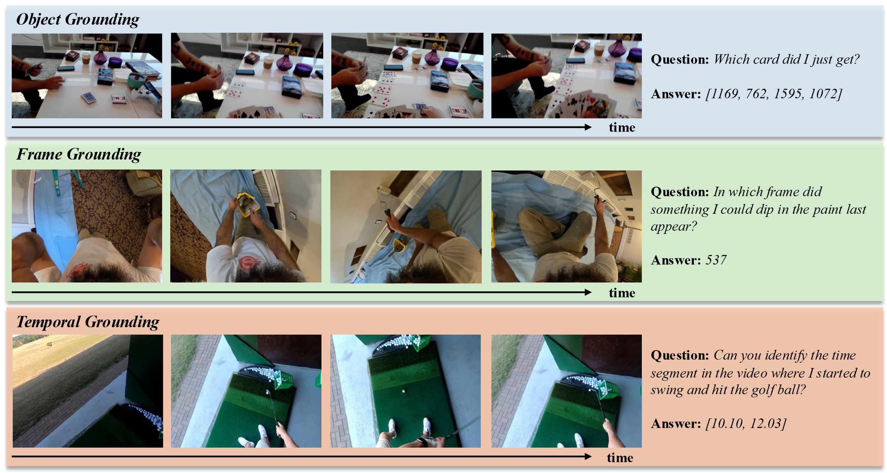
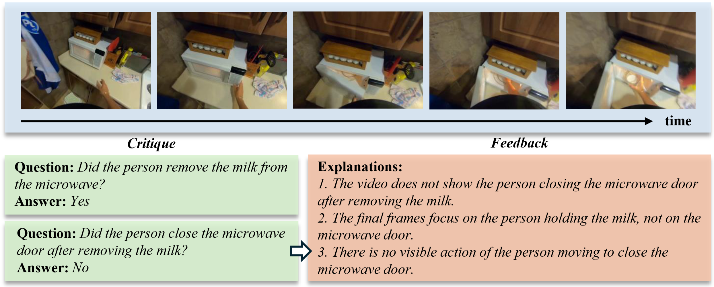

<div align="center">

<h2>VidEgoThink: Assessing Egocentric Video Understanding Capabilities for Embodied AI</h2>

[**🌐 Homepage**](https://adacheng.github.io/VidEgoThink) | [**🤗 Paper**](https://huggingface.co/papers/2410.11623) | [**📖 arXiv**](https://arxiv.org/pdf/2410.11623) | [**🏆 Leaderboard**](https://adacheng.github.io/VidEgoThink/#leaderboard)

<p align="center">
  
</p>

<b><i>Figure 1:</i></b> The main tasks of VidEgoThink benchmark to comprehensively assess the egocentric video understanding capabilities in Embodied AI. There are four types of tasks, including video question answering, hierarchy planning, visual grounding, and reward modeling. These four tasks are complementary to each other to implement a complete goal for Embodied AI.
</div>


## 🔔 News
<i>
[2024-10]: <a href="https://huggingface.co/papers/2410.11623">VidEgoThink</a> is the Top-1 paper of Oct-17 in Hugging Face. 🔥<br>
[2024-10]: Our paper <a href="https://arxiv.org/abs/2410.11623">VidEgoThink: Assessing Egocentric Video Understanding Capabilities for Embodied AI</a> has been released.<br>
[2024-09]: <a href="https://adacheng.github.io/EgoThink/">EgoThink</a> and VidEgoThink is invited to be presented in <a href="https://zhidx.com/p/441426.html">ZhiDX</a>.<br>
</i>

## 💾 VidEgoThink Benchmark

Given that the utilization of foundation models in Embodied AI remains an open research question, we carefully design four types of interrelated tasks for comprehensive assessment: (i) <i>video question-answering</i>, (ii) <i>hierarchy planning</i>, (iii) <i>visual grounding</i>, (iv) <i>reward modeling</i>.

### 1. Video Question Answering

<div align="center">
  

  <b><i>Figure 2:</i></b> Case of video question answering.
</div>

### 2. Hierarchy Planning

<div align="center">
  

  <b><i>Figure 2:</i></b> Case of hierarchy planning.
</div>

### 3. Visual Grounding

<div align="center">
  

  <b><i>Figure 2:</i></b> Case of visual grounding.
</div>

### 4. Reward Modeling

<div align="center">
  

  <b><i>Figure 2:</i></b> Case of reward modeling.
</div>


## 💾 Dataset

### 1. Download Original Egocentric Videos

You can use [Ego4D CLI](https://ego4d-data.org/docs/CLI/) to get the original egocentric videos of [Ego4d GoalStep](https://github.com/facebookresearch/ego4d-goalstep?tab=readme-ov-file#download).

```sh
# download goalstep videos
ego4d --datasets full_scale --benchmark goalstep -o <out-dir>
```

### 2. Download Our Annotations

Please directly clone our [GitHub Repo](https://github.com/AdaCheng/VidEgoThink/tree/main/data).

```sh
git clone https://github.com/AdaCheng/VidEgoThink.git
cd data
```

### 3. Prepare Videos and Images

Considering the [license](https://ego4ddataset.com/ego4d-license/) of [Ego4D](https://ego4d-data.org/) and the large file size, readers need to use our scripts to process the original egocentric videos.

@todo

> 😎 We will also try to share our videos and images to external cloud soon.

<!-- 

## 🔧 Dependencies
> Here we provide the basic environment, you need to additionally install requirements for your evaluated open-source models.

```sh
conda create --name egothink python=3.10
conda activate egothink
pip install -U pip

# Install requirements
pip install -r requirements.txt
```

## 📊 Evaluation

### Add New Open-Source Models

> 🫰 <b>Thank you very much if you would like to contribute the code of the new model you have deployed!</b>

1. create `test_{new_model}.py` in `/models`.
2. Add the new model in `get_model()` in `/models/__init__.py`.
```python
# BLIP2-7B
if model_name == 'blip2-7b':
  from .test_blip2 import TestBlip2
  return TestBlip2(name='blip2_opt', model_type='pretrain_opt6.7b', config_path='/models/blip_configs/blip2_pretrain_opt6.7b.yaml', device=device)
```

### Inference

- API-based Model

Please update the API-based models' keys and base_urls between the line 23 to line 33 of file [gpt_eval.py](https://github.com/AdaCheng/EgoThink/blob/main/gpt_eval.py#L23).
```sh
# dataset: Activity, Object/existence, etc.
# MODEL: GPT series models, such as gpt-4o
python gpt_eval.py \
    --model_name $MODEL \
    --annotation_path /${dataset}/annotations.json \
    --answer_path /answer/${dataset} \
```

- Open-Source Model
```sh
# dataset: Activity, Object/existence, etc.
# MODEL: models defined in the models file
# DEVICE: GPU id, 0/1/2..., currently only single card can run
python eval.py \
    --model_name $MODEL \
    --annotation_path /${dataset}/annotations.json \
    --answer_path /answer/${dataset} \
    --batch_size 1 \
    --device $DEVICE
```

### Evaluation

Please update the API-based models' key and base between the line 463 to line 546 of file [common.py](https://github.com/AdaCheng/EgoThink/blob/main/common.py#L463).

```sh
# data-folder: the folder name of answer.
# bench-name: Activity, Object/existence, etc.
# EVA_MODELS: a list of models to be evaluated (separated by spaces), for example "llava-13b-llama2 llava-1.5-13b llava-1.5-7b"
# $EVA_JUDGE_MODEL: gpt-4o (default), gpt-3.5-turbo, claude-2, etc.
python  gen_judgment.py \
    --data-folder /answer \
    --bench-name $dataset \
    --mode single \
    --model-list $EVA_MODELS \
    --judge-model $EVA_JUDGE_MODEL 
    --parallel 4
    --judge-file judge_prompts.jsonl
```

### Show Results

```sh
# EVA_MODELS: a list of models to be evaluated (separated by spaces), for example "llava-13b-llama2 llava-1.5-13b llava-1.5-7b"
# $EVA_JUDGE_MODEL: gpt-4 (default), gpt-3.5-turbo, claude-2, etc.
python show_result.py \
    --input-file {data_folder}/{bench-name}/model_judgment/{judge-model}_single.jsonl \
    --judge-model $EVA_JUDGE_MODEL \
    --model-list  $EVA_MODELS \
    --mode single
```

## 🏆 Leaderboard

### Update
> 👋 <b>Feel free to contribute to the performance of your model by adding it to our "RESULTS SECTION" (from line 398) in <a href="https://github.com/AdaCheng/EgoThink/blob/main/index.html">index.html</a>; we will review and merge it accordingly.</b>

```html
<tr style="background-color: #f8fffe;">
    <td style="text-align: left;"><b>GPT-4V(ision)</b></td>
    <td><b>65.5</b></td>
    <td>62.0</td>
    <td><b>82.0</b></td>
    <td><b>58.0</b></td>
    <td><b>59.5</b></td>
    <td style="text-decoration: underline;">86.0</td>
    <td style="text-decoration: underline;">62.0</td>
    <td><b>42.0</b></td>
    <td>48.0</td>
    <td><b>83.0</b></td>
    <td><b>55.0</b></td>
    <td><b>64.0</b></td>
    <td><b>84.0</b></td>
</tr> 
```

### Overview

The detailed Table can be found in [Here](https://adacheng.github.io/EgoThink/#leaderboard).

<div align="center">
  

  <b><i>Table 1:</i></b> Combined single-answer grading scores on zero-shot setups for various dimensions. The <b>bold</b> indicates the best performance while the <u>underline</u> indicates the second-best performance. Exist, Attr, Afford, Loc, Spatial, Count, Compar, Situated, Nav and Assist represent existence, attribute, affordance, location, spatial relationship, counting, comparison, situated reasoning, navigation, and assistance.
</div> -->


## Contact
- Sijie Cheng: csj23@mails.tsinghua.edu.cn

## Citation

```bibtex
@article{cheng2024videgothink,
title={VidEgoThink: Assessing Egocentric Video Understanding Capabilities for Embodied AI},
author={Cheng, Sijie and Fang, Kechen and Yu, Yangyang and Zhou, Sicheng and Li, Bohao and Tian, Ye and Li, Tingguang and Han, Lei and Liu, Yang},
journal={arXiv preprint arXiv:2410.11623},
year={2024}
}
```

## Acknowledge
Thanks to Xiang Yue, Yuanzhi Li, Jiangjie Chen for their early discussion.

Furthermore, we appreciate the developers behind the following projects for their significant contributions to our research: [EgoThink](https://github.com/AdaCheng/EgoThink), [Ego4D](https://github.com/facebookresearch/Ego4d), [Multi-Modality-Arena](https://github.com/OpenGVLab/Multi-Modality-Arena/tree/main/tiny_lvlm_evaluation), [FastChat](https://github.com/lm-sys/FastChat).

