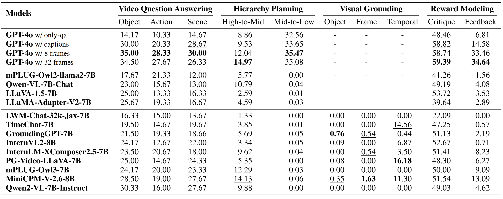

<div align="center">

<h2>VidEgoThink: Assessing Egocentric Video Understanding Capabilities for Embodied AI</h2>

[**🌐 Homepage**](https://adacheng.github.io/VidEgoThink) | [**🤗 Paper**](https://huggingface.co/papers/2410.11623) | [**📖 arXiv**](https://arxiv.org/pdf/2410.11623) | [**🏆 Leaderboard**](https://adacheng.github.io/VidEgoThink/#leaderboard)

<p align="center">
  
</p>

<b><i>Figure 1:</i></b> The main tasks of VidEgoThink benchmark to comprehensively assess the egocentric video understanding capabilities in Embodied AI. There are four types of tasks, including video question answering, hierarchy planning, visual grounding, and reward modeling. These four tasks are complementary to each other to implement a complete goal for Embodied AI.
</div>


## 🔔 News
<i>
[2024-10]: <a href="https://huggingface.co/papers/2410.11623">VidEgoThink</a> is the Top-1 paper of Oct-17 in Hugging Face. 🔥<br>
[2024-10]: Our paper <a href="https://arxiv.org/abs/2410.11623">VidEgoThink: Assessing Egocentric Video Understanding Capabilities for Embodied AI</a> has been released.<br>
[2024-09]: <a href="https://adacheng.github.io/EgoThink/">EgoThink</a> and VidEgoThink is invited to be presented in <a href="https://zhidx.com/p/441426.html">ZhiDX</a>.<br>
</i>

## 💾 VidEgoThink Benchmark

Given that the utilization of foundation models in Embodied AI remains an open research question, we carefully design four types of interrelated tasks for comprehensive assessment: (i) <i>video question-answering</i>, (ii) <i>hierarchy planning</i>, (iii) <i>visual grounding</i>, (iv) <i>reward modeling</i>.

### 1. Video Question Answering

<div align="center">
  

  <b><i>Figure 2:</i></b> Case of video question answering.
</div>

### 2. Hierarchy Planning

<div align="center">
  

  <b><i>Figure 3:</i></b> Case of hierarchy planning.
</div>

### 3. Visual Grounding

<div align="center">
  

  <b><i>Figure 4:</i></b> Case of visual grounding.
</div>

### 4. Reward Modeling

<div align="center">
  

  <b><i>Figure 5:</i></b> Case of reward modeling.
</div>


## 💾 Dataset

### 1. Download Original Egocentric Videos

You can use [Ego4D CLI](https://ego4d-data.org/docs/CLI/) to get the original egocentric videos of [Ego4d GoalStep](https://github.com/facebookresearch/ego4d-goalstep?tab=readme-ov-file#download).

```sh
# download goalstep videos
ego4d --datasets full_scale --benchmark goalstep -o <out-dir>
```

### 2. Download Our Annotations

Please directly clone our [GitHub Repo](https://github.com/AdaCheng/VidEgoThink/tree/main/data).

```sh
git clone https://github.com/AdaCheng/VidEgoThink.git
cd data
```

The format of our annotations are as follows, where this ```video_path``` indicates the clipped video from ```start_time``` to ```end_time``` of the original ```video_uid``` in Ego4D GoalStep. The ```image_path``` contains the uniformly sampled keyframes from our clipped videos.

```json
[
    {
        "video_uid": "a13a145f-920a-44ec-8aef-b489c097f4a7",
        "start_time": 294.21739,
        "end_time": 341.15273,
        "video_path": "151.mp4",
        "image_path": [
            "151/frame_0001.png",
            "151/frame_0015.png",
            "151/frame_0030.png",
            "151/frame_0045.png",
            "151/frame_0060.png",
            "151/frame_0074.png",
            "151/frame_0089.png",
            "151/frame_0104.png"
        ],
        "question": "How many times did I adjust a container in the cupboard with my right hand?",
        "answer": "Twice."
    },
]
```


### 3. Prepare Videos and Images

> Considering the [license](https://ego4ddataset.com/ego4d-license/) of [Ego4D](https://ego4d-data.org/) and the large file size, readers need to use our scripts to process the original egocentric videos. 😎 We will also try to share our videos and images to external cloud soon.

- Prepare clipped videos.

```sh
python video_clip.py \
    --data_path /VidEgoThin/data/${annotation_file} \
    --video_folder /goal_step/v2/full_scale/ \
    --output_folder /data/${clipped_video_folder}
```

- Prepare sampled keyframes. (Optional, we use the same keyframes for multi-images MLLMs to ensure fairness. You can choose better strategy.)

```sh
python keyframe_extract.py \
    --input_folder /data/${clipped_video_folder} \
    --output_folder /data/${keyframe_folder}
```

<!-- 

## 🔧 Dependencies
> Here we provide the basic environment, you need to additionally install requirements for your evaluated open-source models.

```sh
conda create --name egothink python=3.10
conda activate egothink
pip install -U pip

# Install requirements
pip install -r requirements.txt
```
--> 

## 📊 Evaluation

### Add New Open-Source Models

> 🫰 <b>Thank you very much if you would like to contribute the code of the new model you have deployed!</b>

1. create `test_{new_model}.py` in `/models`.
2. Add the new model in `get_model()` in `/models/__init__.py`.
```python
# Qwen2-VL-7B-Instruct
if model_name == 'qwen2_vl':
    from .test_qwen2vl import TestQwen2VL
    return TestQwen2VL(device)
```

### Inference

- API-based Model

Please update the API-based models' keys and base_urls between the line 23 to line 33 of file [gpt_eval.py](https://github.com/AdaCheng/VidEgoThink/blob/main/gpt_eval.py#L23).
```sh
# dataset: Activity, Object/existence, etc.
# MODEL: GPT series models, such as gpt-4o
python gpt_eval.py \
    --model_name $MODEL \
    --annotation_path /${dataset}/annotations.json \
    --answer_path /answer/${dataset} \
```

- Open-Source Model
```sh
# dataset: Activity, Object/existence, etc.
# MODEL: models defined in the models file
# DEVICE: GPU id, 0/1/2..., currently only single card can run
python eval.py \
    --model_name $MODEL \
    --annotation_path /${dataset}/annotations.json \
    --answer_path /answer/${dataset} \
    --batch_size 1 \
    --device $DEVICE
```

### Evaluation

Please update the API-based models' key and base between the line 463 to line 546 of file [common.py](https://github.com/AdaCheng/VidEgoThink/blob/main/common.py#L463).

```sh
# data-folder: the folder name of answer.
# bench-name: Activity, Object/existence, etc.
# EVA_MODELS: a list of models to be evaluated (separated by spaces), for example "llava-13b-llama2 llava-1.5-13b llava-1.5-7b"
# $EVA_JUDGE_MODEL: gpt-4o (default), gpt-3.5-turbo, claude-2, etc.
python  gen_judgment.py \
    --data-folder /answer \
    --bench-name $dataset \
    --mode single \
    --model-list $EVA_MODELS \
    --judge-model $EVA_JUDGE_MODEL 
    --parallel 4
    --judge-file judge_prompts.jsonl
```

### Show Results

```sh
# EVA_MODELS: a list of models to be evaluated (separated by spaces), for example "llava-13b-llama2 llava-1.5-13b llava-1.5-7b"
# $EVA_JUDGE_MODEL: gpt-4 (default), gpt-3.5-turbo, claude-2, etc.
python show_result.py \
    --input-file {data_folder}/{bench-name}/model_judgment/{judge-model}_single.jsonl \
    --judge-model $EVA_JUDGE_MODEL \
    --model-list  $EVA_MODELS \
    --mode single
```

## 🏆 Leaderboard

<!-- ### Update
> 👋 <b>Feel free to contribute to the performance of your model by adding it to our "RESULTS SECTION" (from line 398) in <a href="https://github.com/AdaCheng/EgoThink/blob/main/index.html">index.html</a>; we will review and merge it accordingly.</b>

```html
<tr style="background-color: #f8fffe;">
    <td style="text-align: left;"><b>GPT-4V(ision)</b></td>
    <td><b>65.5</b></td>
    <td>62.0</td>
    <td><b>82.0</b></td>
    <td><b>58.0</b></td>
    <td><b>59.5</b></td>
    <td style="text-decoration: underline;">86.0</td>
    <td style="text-decoration: underline;">62.0</td>
    <td><b>42.0</b></td>
    <td>48.0</td>
    <td><b>83.0</b></td>
    <td><b>55.0</b></td>
    <td><b>64.0</b></td>
    <td><b>84.0</b></td>
</tr> 
``` -->

### Overview

<!-- The detailed Table can be found in [Here](https://adacheng.github.io/EgoThink/#leaderboard). -->

<div align="center">
  

  <b><i>Table 1:</i></b> Experimental results of video question answering. OE, OO, OI, OC, OS, OP denote object existence, object order, object interaction, object count, object state, object prediction. AE, AS, AC indicates action existence, action sequence, action count. SE, ST, SP denote scene existence, scene transition, scene prediction. The bold font denotes the best performance and the underline font denotes the second-best performance.
</div>

<div align="center">
  

  <b><i>Table 2:</i></b> Experimental results of video question answerng, hierarchy planning, visual grounding, and reward modeling tasks. The bold font denotes the best performance and the underline font denotes the second-best performance.
</div>


## Contact
- Sijie Cheng: csj23@mails.tsinghua.edu.cn

## Citation

```bibtex
@article{cheng2024videgothink,
title={VidEgoThink: Assessing Egocentric Video Understanding Capabilities for Embodied AI},
author={Cheng, Sijie and Fang, Kechen and Yu, Yangyang and Zhou, Sicheng and Li, Bohao and Tian, Ye and Li, Tingguang and Han, Lei and Liu, Yang},
journal={arXiv preprint arXiv:2410.11623},
year={2024}
}
```

> If you are intested in our VidEgoThink, we strongly recommend you to read our previous related work, <b>[EgoThink](https://adacheng.github.io/EgoThink/).</b>🥰
```bibtex
@InProceedings{Cheng_2024_CVPR,
    author    = {Cheng, Sijie and Guo, Zhicheng and Wu, Jingwen and Fang, Kechen and Li, Peng and Liu, Huaping and Liu, Yang},
    title     = {EgoThink: Evaluating First-Person Perspective Thinking Capability of Vision-Language Models},
    booktitle = {Proceedings of the IEEE/CVF Conference on Computer Vision and Pattern Recognition (CVPR)},
    month     = {June},
    year      = {2024},
    pages     = {14291-14302}
}
```


## Acknowledge

Thanks to Yuyang You for his support in data collection and inference. Thanks to Xiang Yue, Yuanzhi Li, Jiangjie Chen for their early discussion.

Furthermore, we appreciate the developers behind the following projects for their significant contributions to our research: [EgoThink](https://github.com/AdaCheng/EgoThink), [Ego4D](https://github.com/facebookresearch/Ego4d), [Multi-Modality-Arena](https://github.com/OpenGVLab/Multi-Modality-Arena/tree/main/tiny_lvlm_evaluation), [FastChat](https://github.com/lm-sys/FastChat).

